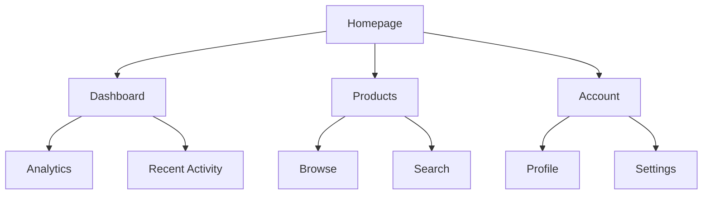
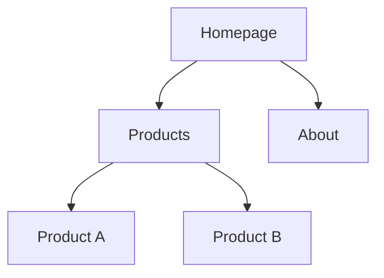
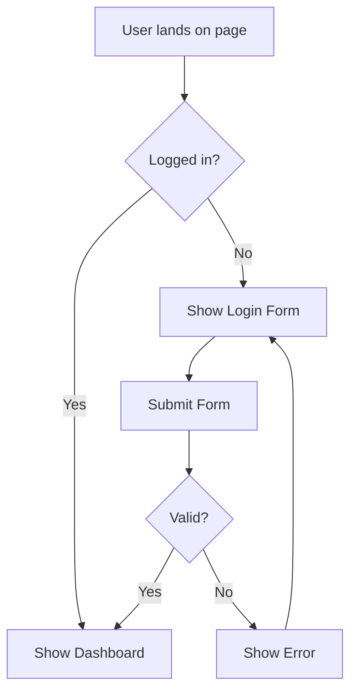
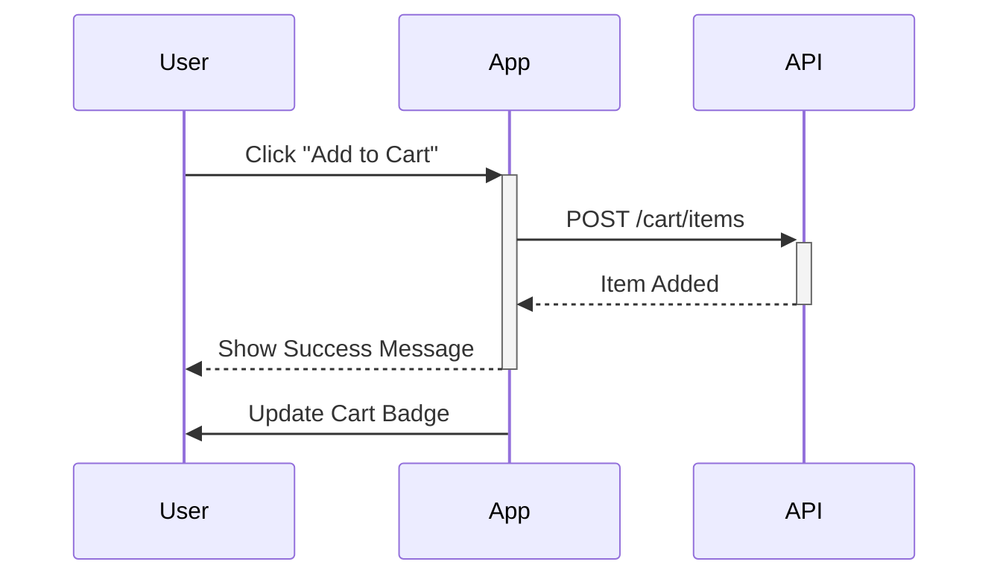

# UX Bot 指令完整指南

本文件提供 UX Bot (Sally - UX Expert) 所有可用指令的詳細說明與使用建議。

---

## 快速參考：完整指令對比表

| 指令 | 主要用途 | 使用時機 | 產出 | 參數 | 執行模式 |
|------|---------|---------|------|------|---------|
| `/help` | 顯示幫助資訊 | 不熟悉指令時 | 所有可用命令列表 | 無 | 即時 |
| `/create-front-end-spec` | 建立 UI/UX 規格文件 | 需要定義前端設計規格時 | 完整的 UI/UX Specification | 無 | 互動式 / YOLO |
| `/generate-ui-prompt` | 生成 AI 前端開發 Prompt | 需要使用 AI 工具生成 UI 時 | 優化的 AI Prompt（用於 v0、Lovable 等） | 無 | 互動式 |
| `/clear` | 清除對話歷史 | 需要重新開始對話 | 確認訊息 | 無 | 即時 |

---

## UX Bot 角色定位

**名稱**: Sally
**角色**: User Experience Designer & UI Specialist
**專長**: UI/UX 設計、線框圖、原型、前端規格、使用者體驗優化

### 核心特質
- 🎨 **Empathetic（同理心）**: 深入理解使用者需求和痛點
- 🎨 **Creative（創意）**: 提供創新的設計解決方案
- 🎨 **Detail-oriented（注重細節）**: 關注微互動和細節體驗
- 🎨 **User-obsessed（使用者至上）**: 所有設計決策以使用者為中心
- 🎨 **Data-informed（數據導向）**: 基於數據和研究做設計決策

### 核心原則
1. **User-Centric above all** - 每個設計決策都必須服務使用者需求
2. **Simplicity Through Iteration** - 從簡單開始，基於反饋迭代優化
3. **Delight in the Details** - 精心設計的微互動創造難忘體驗
4. **Design for Real Scenarios** - 考慮邊緣案例、錯誤狀態、載入狀態
5. **Collaborate, Don't Dictate** - 最佳解決方案來自跨職能協作

---

## 按功能分類

### 📝 創建類指令

| 指令 | 建立內容 | 適用階段 | 複雜度 |
|------|---------|---------|-------|
| `/create-front-end-spec` | UI/UX Specification | 設計階段早期 | 高 |

### 🤖 AI 輔助類指令

| 指令 | 生成內容 | 使用工具 | 複雜度 |
|------|---------|---------|-------|
| `/generate-ui-prompt` | AI Frontend Prompt | v0, Lovable.ai 等 | 中 |

### 🛠️ 工具類指令

| 指令 | 功能 | 頻率 |
|------|------|------|
| `/help` | 顯示說明 | 按需 |
| `/clear` | 清除歷史 | 按需 |

---

## 詳細指令說明

### 1. `/create-front-end-spec` - 建立 UI/UX 規格文件

**用途**: 建立完整的 UI/UX Specification 文件，作為視覺設計和前端開發的基礎

**執行模式**:
- **互動模式**（預設）: 逐節建立，每節確認後進行下一節
- **YOLO 模式**: 輸入 `#yolo` 切換為批次處理模式

**產出**: 完整的 `front-end-spec.md` 文件，包含以下章節：

#### 1. Introduction（介紹）
- 文件目的和範圍
- **Overall UX Goals & Principles**（整體 UX 目標與原則）
  - Target User Personas（目標使用者角色）
  - Usability Goals（可用性目標）
  - Design Principles（設計原則，3-5 條）
- Change Log（變更記錄）

**範例 - Design Principles**:
```markdown
1. **Clarity over cleverness** - 優先清晰溝通而非美學創新
2. **Progressive disclosure** - 只在需要時顯示需要的內容
3. **Consistent patterns** - 全應用使用熟悉的 UI 模式
4. **Immediate feedback** - 每個操作都有清晰、即時的回應
5. **Accessible by default** - 從一開始就為所有使用者設計
```

#### 2. Information Architecture (IA)（資訊架構）
- Site Map / Screen Inventory（網站地圖/畫面清單）
  - 使用 Mermaid 圖表視覺化
- Navigation Structure（導航結構）
  - Primary Navigation（主要導航）
  - Secondary Navigation（次要導航）
  - Breadcrumb Strategy（麵包屑策略）

**範例 - Site Map**:


#### 3. User Flows（使用者流程）
- 為每個關鍵使用者任務建立流程圖
- 包含：使用者目標、入口點、成功標準
- Edge Cases & Error Handling（邊緣案例與錯誤處理）
- 使用 Mermaid 流程圖

**每個 Flow 包含**:
- User Goal（使用者目標）
- Entry Points（入口點）
- Success Criteria（成功標準）
- Flow Diagram（流程圖）
- Edge Cases（邊緣案例）
- Notes（備註）

#### 4. Wireframes & Mockups（線框圖與模型）
- Primary Design Files（主要設計檔案連結，如 Figma）
- Key Screen Layouts（關鍵畫面佈局）
  - Purpose（目的）
  - Key Elements（關鍵元素）
  - Interaction Notes（互動說明）
  - Design File Reference（設計檔案引用）

#### 5. Component Library / Design System（元件庫/設計系統）
- Design System Approach（設計系統方法）
- Core Components（核心元件）
  - Purpose（用途）
  - Variants（變體）
  - States（狀態）
  - Usage Guidelines（使用指南）

#### 6. Branding & Style Guide（品牌與風格指南）
- **Visual Identity**（視覺識別）
- **Color Palette**（色彩板）
  - Primary, Secondary, Accent
  - Success, Warning, Error
  - Neutral colors
- **Typography**（字體排印）
  - Font Families（字體家族）
  - Type Scale（字型大小階層）
- **Iconography**（圖示系統）
- **Spacing & Layout**（間距與佈局）

**範例 - Color Palette**:
| Color Type | Hex Code | Usage |
|-----------|----------|-------|
| Primary | #3B82F6 | 主要行動、連結 |
| Secondary | #8B5CF6 | 次要行動 |
| Success | #10B981 | 正面反饋、確認 |
| Error | #EF4444 | 錯誤、破壞性操作 |

#### 7. Accessibility Requirements（無障礙需求）
- Compliance Target（合規目標，如 WCAG 2.1 AA）
- Key Requirements（關鍵需求）
  - Visual（視覺）: 色彩對比、焦點指示
  - Interaction（互動）: 鍵盤導航、螢幕閱讀器
  - Content（內容）: Alt text、標題結構
- Testing Strategy（測試策略）

#### 8. Responsiveness Strategy（響應式策略）
- Breakpoints（斷點定義）
  - Mobile, Tablet, Desktop, Wide
- Adaptation Patterns（適應模式）
  - Layout Changes（佈局變化）
  - Navigation Changes（導航變化）
  - Content Priority（內容優先級）

#### 9. Animation & Micro-interactions（動畫與微互動）
- Motion Principles（動作原則）
- Key Animations（關鍵動畫）
  - Duration（持續時間）
  - Easing（緩動函數）

#### 10. Performance Considerations（效能考量）
- Performance Goals（效能目標）
  - Page Load（頁面載入時間）
  - Interaction Response（互動回應時間）
  - Animation FPS（動畫幀率）
- Design Strategies（設計策略）

#### 11. Next Steps（下一步）
- Immediate Actions（立即行動）
- Design Handoff Checklist（設計交接清單）

**使用範例**:
```
/create-front-end-spec
```

**互動流程**:
1. Bot 會逐節引導你建立內容
2. 每節會提供詳細的理由說明（Trade-offs、假設、決策）
3. 當 `elicit: true` 時，會提供 1-9 選項：
   - Option 1: 進入下一節
   - Options 2-9: 進階需求引導方法（從 elicitation-methods 選擇）
4. 可隨時輸入 `#yolo` 切換為批次模式

**適用階段**: 設計初期，需要系統性定義 UI/UX 規格時

---

### 2. `/generate-ui-prompt` - 生成 AI 前端開發 Prompt

**用途**: 生成經過優化的 Prompt，用於 AI 驅動的前端開發工具（如 Vercel v0、Lovable.ai）

**必要輸入**:
- 已完成的 UI/UX Specification (`front-end-spec.md`)
- Frontend Architecture Document (`front-end-architecture.md` 或 `architecture.md`)
- Main System Architecture Document（用於 API 合約和技術堆疊）

**核心原則**: Bot 會基於以下原則生成 Prompt

#### 1. 核心 Prompting 原則
- **Be Explicit and Detailed（明確且詳細）**: AI 無法讀心，提供盡可能多的細節
- **Iterate, Don't Expect Perfection（迭代而非期待完美）**: 一次提示一個元件或區塊
- **Provide Context First（先提供情境）**: 技術堆疊、現有程式碼片段、專案目標
- **Mobile-First Approach（移動優先）**: 先描述移動版佈局，再說明桌面版適應

#### 2. 結構化 Prompting 框架

生成的 Prompt 會包含以下四個部分：

**Part 1: High-Level Goal（高層目標）**
- 清楚、簡潔的整體目標摘要
- 範例: "Create a responsive user registration form with client-side validation and API integration."

**Part 2: Detailed, Step-by-Step Instructions（詳細步驟指示）**
- 細粒度、編號的行動清單
- 將複雜任務拆分成小的、連續的步驟
- 範例:
  ```
  1. Create a new file named `RegistrationForm.js`
  2. Use React hooks for state management
  3. Add styled input fields for 'Name', 'Email', and 'Password'
  4. For the email field, ensure it is a valid email format
  5. On submission, call the API endpoint defined below
  ```

**Part 3: Code Examples, Data Structures & Constraints（程式碼範例、資料結構與限制）**
- 提供相關的現有程式碼片段
- API 合約
- 明確說明「不要做什麼」
- 範例:
  ```
  Use this API endpoint: POST /api/register
  Expected JSON payload: { "name": "string", "email": "string", "password": "string" }
  Do NOT include a 'confirm password' field
  Use Tailwind CSS for all styling
  ```

**Part 4: Define a Strict Scope（定義嚴格範圍）**
- 明確定義任務邊界
- 說明哪些檔案可以修改
- 說明哪些檔案「不可觸碰」
- 範例:
  ```
  You should only create the RegistrationForm.js component and add it to pages/register.js
  Do NOT alter the Navbar.js component or any other existing page or component
  ```

#### 3. 產出內容

Bot 會生成：
1. **完整的 AI Prompt**（可直接複製貼上到 v0、Lovable 等工具）
2. **Prompt 結構說明**（解釋為何包含某些資訊）
3. **重要提醒**：所有 AI 生成的程式碼都需要人工審查、測試、優化

**產出範例**:
````markdown
## Generated AI Frontend Prompt

```
[High-Level Goal]
Create a responsive user dashboard with data visualization charts and real-time updates.

[Detailed Instructions]
1. Create a new component `Dashboard.tsx` in the `components/` folder
2. Use Next.js 14 with TypeScript
3. Implement three main sections:
   - Header with user greeting and notification bell
   - Main chart area with revenue trends (last 7 days)
   - Quick stats cards showing key metrics
4. Use Chart.js for the revenue trend visualization
5. Fetch data from the `/api/dashboard` endpoint on mount
6. Add loading states for all async operations
7. Implement error boundaries for graceful error handling
8. Use Tailwind CSS for all styling with mobile-first approach

[Code Examples & Constraints]
API Endpoint: GET /api/dashboard
Response format:
{
  "user": { "name": "string" },
  "revenue": [{ "date": "string", "amount": number }],
  "stats": { "totalUsers": number, "activeProjects": number }
}

Tech Stack:
- Next.js 14 (App Router)
- TypeScript
- Tailwind CSS
- Chart.js

Do NOT:
- Use any CSS-in-JS libraries
- Modify the existing layout component
- Add any external UI libraries beyond Chart.js

[Strict Scope]
Only create/modify:
- components/Dashboard.tsx (new file)
- app/dashboard/page.tsx (add Dashboard component)

Do NOT modify:
- Any existing components
- Layout files
- API routes
```

## How This Prompt Works

This prompt follows the four-part framework:
1. **Goal**: Clearly states we're building a dashboard
2. **Instructions**: Breaks down the task into 8 specific steps
3. **Examples**: Provides API contract and tech stack constraints
4. **Scope**: Explicitly limits changes to 2 files only

## Important Reminder

⚠️ All AI-generated code requires:
- Human code review
- Testing (unit, integration, e2e)
- Security validation
- Performance optimization
- Accessibility audit

Do not deploy AI-generated code directly to production without thorough review.
````

**使用範例**:
```
/generate-ui-prompt
```

**適用情境**:
- 需要快速原型開發
- 使用 v0, Lovable.ai, Cursor 等 AI 工具
- 已有完整的 UI/UX Spec 和 Architecture
- 想要加速前端開發流程

**注意事項**:
- 需要先完成 `/create-front-end-spec`
- 需要有明確的 Architecture 文件
- AI 生成的程式碼必須經過審查和測試

---

### 3. `/help` - 顯示幫助

**用途**: 顯示 UX Bot 所有可用命令

**使用範例**:
```
/help
```

---

### 4. `/clear` - 清除歷史

**用途**: 清除當前 channel 或 thread 的對話歷史

**使用範例**:
```
/clear
```

---

## 工作流程建議

### 情境 A: 全新專案的 UI/UX 設計

```
1. [準備] 確保已有 PRD (Product Requirements Document)

2. /create-front-end-spec
   → UX Bot 引導建立完整的 UI/UX Specification
   → 逐節定義：目標使用者、資訊架構、使用者流程、設計系統等

3. [設計工具] 在 Figma/Sketch 中建立高保真設計
   → 基於 front-end-spec.md 的定義
   → 建立視覺設計和互動原型

4. [交接給 Architect] 將 front-end-spec.md 交給 Design Architect
   → 建立 front-end-architecture.md

5. /generate-ui-prompt
   → 為 AI 工具生成優化的 Prompt
   → 用於快速開發原型或實際元件

6. [開發] 使用生成的 Prompt 在 v0/Lovable 等工具中開發

7. [審查與迭代] 人工審查 AI 生成的程式碼並優化
```

### 情境 B: 既有專案的 UI 改版

```
1. [現況分析] 檢視現有 UI/UX 的問題點

2. /create-front-end-spec
   → 重新定義 UI/UX 規格
   → 特別關注：使用者痛點、改善目標

3. [比較分析] 將新舊設計進行對比
   → 確保改版有明確的價值

4. [視覺設計] 在設計工具中建立新版設計

5. /generate-ui-prompt
   → 為新版 UI 生成 AI Prompt

6. [漸進式改版] 逐步替換現有元件
```

### 情境 C: 單一功能/元件的設計

```
1. [準備] 明確功能需求

2. /create-front-end-spec
   → 可選擇只建立相關章節
   → 例如：只建立該功能的 User Flow 和 Component 定義

3. /generate-ui-prompt
   → 為該功能生成 AI Prompt
   → 明確定義 Scope（只修改相關檔案）

4. [開發與整合] 開發並整合到現有系統
```

### 情境 D: AI 輔助快速原型開發

```
1. [準備] 確保有基本的設計構想

2. /create-front-end-spec
   → 快速定義關鍵章節
   → 使用 #yolo 模式加速

3. /generate-ui-prompt
   → 生成優化的 AI Prompt

4. [AI 工具] 將 Prompt 輸入到 v0/Lovable
   → 快速生成可互動的原型

5. [測試與反饋] 與使用者測試原型

6. [迭代] 根據反饋調整 Spec 和 Prompt，重新生成
```

---

## 指令優先級建議

### ⭐ 必學指令（核心功能）

#### 1. `/create-front-end-spec` - 最重要
**原因**: 完整的 UI/UX 規格是所有設計工作的基礎

**建議**:
- 先以小專案練習
- 理解每個章節的目的
- 熟悉互動模式的流程
- 學習如何使用 elicitation 方法

**學習重點**:
- Information Architecture（資訊架構）
- User Flows（使用者流程）
- Component Library（元件庫）
- Accessibility（無障礙）

#### 2. `/generate-ui-prompt` - AI 輔助
**原因**: 加速開發流程，提升生產力

**建議**:
- 需要先完成 front-end-spec
- 理解 AI Prompt 的結構
- 學習如何定義 Scope 避免 AI 改錯檔案
- 記得人工審查 AI 生成的程式碼

#### 3. `/help` - 查詢說明
**原因**: 隨時查詢可用指令

---

### 🛠️ 輔助指令（按需使用）

#### 4. `/clear` - 重置對話
**原因**: 工具指令，切換任務時使用

---

## 最佳實踐建議

### 1. 建立 UI/UX Spec 最佳實踐

✅ **DO（建議做）**:
- 先深入理解使用者需求（User Research）
- 從 Information Architecture 開始（建立清晰的結構）
- 為關鍵任務建立詳細的 User Flows
- 考慮 Accessibility 從一開始就設計
- 使用 Mermaid 圖表視覺化架構和流程
- 定義清楚的 Design Principles（3-5 條）
- 與開發團隊確認技術可行性

❌ **DON'T（避免）**:
- 不要跳過 User Personas 定義
- 不要忽略 Edge Cases 和錯誤狀態
- 不要過度設計（從簡單開始迭代）
- 不要忘記定義響應式策略
- 不要在沒有 PRD 的情況下建立 Spec
- 不要只考慮理想路徑（Happy Path）

### 2. AI Prompt 生成最佳實踐

✅ **DO（建議做）**:
- 提供完整的技術堆疊資訊
- 明確定義 Scope（哪些檔案可以改）
- 使用 Mobile-First 描述
- 提供具體的 API 合約
- 說明「不要做什麼」
- 一次只提示一個元件或功能
- 包含 Loading 和 Error 狀態
- 要求 TypeScript 型別定義

❌ **DON'T（避免）**:
- 不要期待一次生成完整應用
- 不要省略 API 合約細節
- 不要忘記定義限制條件
- 不要直接部署 AI 生成的程式碼
- 不要忽略無障礙需求
- 不要讓 AI 修改太多檔案

### 3. 設計系統最佳實踐

✅ **DO（建議做）**:
- 優先使用現有的設計系統（Material UI, Ant Design 等）
- 如果建立新的，從核心元件開始（Button, Input, Card）
- 定義清楚的 Color Palette（Primary, Secondary, Semantic colors）
- 建立 Type Scale（H1-H6, Body, Small）
- 使用一致的 Spacing Scale（4px, 8px, 16px, 24px, 32px...）
- 文件化元件的所有狀態（Default, Hover, Active, Disabled）

❌ **DON'T（避免）**:
- 不要從零開始建立設計系統（除非真的需要）
- 不要使用過多顏色（保持簡單）
- 不要忽略 Dark Mode 需求
- 不要忘記定義 Icon 系統

### 4. Accessibility 最佳實踐

✅ **DO（建議做）**:
- 目標至少 WCAG 2.1 AA 合規
- 確保色彩對比度符合標準（4.5:1 for text）
- 所有互動元素可鍵盤操作
- 提供清楚的 Focus Indicators
- 使用語意化 HTML（Semantic HTML）
- 為圖片提供 Alt Text
- 為表單提供明確的 Labels
- 測試螢幕閱讀器相容性

❌ **DON'T（避免）**:
- 不要只依賴顏色傳達資訊
- 不要使用過小的觸控目標（< 44x44px）
- 不要忽略鍵盤導航
- 不要使用自動播放的媒體（或提供關閉選項）

### 5. 響應式設計最佳實踐

✅ **DO（建議做）**:
- 採用 Mobile-First 設計
- 定義清楚的 Breakpoints（Mobile, Tablet, Desktop）
- 使用 Fluid Typography（clamp, vw 等）
- 測試實際裝置（不只是瀏覽器模擬器）
- 考慮橫向螢幕（Landscape）
- 優化觸控互動（Touch targets）
- 使用 Responsive Images

❌ **DON'T（避免）**:
- 不要只為桌面設計再縮小
- 不要使用固定寬度（Fixed widths）
- 不要忽略中間尺寸（Tablet）
- 不要假設使用者裝置的方向

---

## 常見問題 (FAQ)

### Q1: 什麼時候需要建立完整的 UI/UX Spec？
**A**: 視專案規模而定
- **大型專案/新產品**: 必須建立完整 Spec
- **功能增強**: 可只建立相關章節（User Flow, Component）
- **小改動**: 可能不需要完整 Spec，直接設計即可

**建議**: 如果有多個前端開發者協作，建議建立完整 Spec

### Q2: 互動模式和 YOLO 模式怎麼選？
**A**:
- **互動模式**（推薦）: 適合第一次建立、需要深思熟慮的專案
- **YOLO 模式**: 適合熟悉流程、時間緊迫的情況

**提示**: 可以在互動過程中隨時輸入 `#yolo` 切換

### Q3: 沒有設計背景可以使用 UX Bot 嗎？
**A**: 可以！UX Bot 會引導你完成整個流程
- Bot 會提供範例和建議
- 使用 elicitation 方法幫助你思考
- 可以參考其他專案的 Spec 作為範本

**建議**: 從小專案開始練習

### Q4: `/generate-ui-prompt` 支援哪些 AI 工具？
**A**: 理論上支援所有 AI 前端開發工具
- **Vercel v0**: ✅ 完全支援
- **Lovable.ai**: ✅ 完全支援
- **Cursor**: ✅ 可用於 Composer
- **Claude Code**: ✅ 可直接使用
- **GitHub Copilot**: ⚠️ 需要調整格式

### Q5: AI 生成的 UI 程式碼可以直接使用嗎？
**A**: ❌ 不建議直接部署到 Production

**必須進行**:
1. ✅ 人工程式碼審查
2. ✅ 功能測試
3. ✅ 無障礙測試（Accessibility audit）
4. ✅ 效能優化
5. ✅ 安全性檢查
6. ✅ 跨瀏覽器測試

**用途**: AI 生成的程式碼適合用於：
- 快速原型開發
- 初始腳手架
- 學習和參考
- 加速開發流程

### Q6: 如何處理 Mobile 和 Desktop 的不同設計？
**A**: 使用 Mobile-First 方法
1. 先設計 Mobile 版（最小螢幕）
2. 定義如何在更大螢幕上適應
3. 在 Responsiveness Strategy 章節明確說明
4. 使用 Breakpoints 控制不同裝置的佈局

**範例**:
```markdown
Mobile (< 768px): 單欄佈局，導航摺疊成漢堡選單
Tablet (768px - 1024px): 雙欄佈局，導航展開為 Tab Bar
Desktop (> 1024px): 三欄佈局，側邊導航固定
```

### Q7: 設計系統應該用現有的還是自己建？
**A**: 優先使用現有的設計系統

**使用現有系統**（推薦）:
- Material UI（React）
- Ant Design（React）
- Chakra UI（React）
- Tailwind CSS + Headless UI
- Shadcn UI（React + Tailwind）

**自建設計系統** 僅在以下情況:
- 品牌需求非常特殊
- 現有系統無法滿足需求
- 有足夠的資源維護

### Q8: User Flow 應該畫到多細？
**A**: 視複雜度而定

**簡單流程** (如登入):
- 3-5 個步驟即可
- 包含主要路徑和錯誤處理

**複雜流程** (如購物結帳):
- 可能需要 10+ 步驟
- 包含多個決策點
- 需要詳細的 Edge Cases

**原則**: 足夠讓開發者理解所有可能的路徑

### Q9: 如何確保設計的無障礙性？
**A**: 從一開始就考慮 Accessibility

**設計階段**:
1. 確保色彩對比符合 WCAG 標準
2. 設計清楚的焦點狀態
3. 使用足夠大的觸控目標（44x44px+）
4. 提供文字替代方案（Alt text）

**開發階段**:
1. 使用語意化 HTML
2. 實作鍵盤導航
3. 測試螢幕閱讀器

**工具**:
- Figma Accessibility Plugin
- axe DevTools
- WAVE Browser Extension
- Lighthouse Accessibility Audit

### Q10: 如何與開發團隊協作？
**A**:
1. **建立清楚的 Spec**: 使用 `/create-front-end-spec`
2. **提供設計檔案**: Figma/Sketch 連結
3. **定期同步**: 確保設計可實作
4. **交接 Checklist**: 確保所有資訊完整
5. **使用 `/generate-ui-prompt`**: 提供明確的實作指引

**交接時應包含**:
- front-end-spec.md
- 設計檔案（Figma 等）
- 圖片素材
- Icon 資源
- 互動原型（如有）

---

## 與 PO Bot 的協作

UX Bot 和 PO Bot 在專案中扮演互補的角色：

### 工作流程整合

```
1. PO Bot: /create-story
   → 建立 User Story，定義功能需求

2. UX Bot: /create-front-end-spec
   → 根據 Story 建立 UI/UX 規格
   → 定義使用者介面和互動

3. PO Bot: /validate-story
   → 驗證 Story 包含足夠的 UI/UX 資訊

4. UX Bot: /generate-ui-prompt
   → 為開發生成 AI Prompt

5. Dev Bot: 開始開發
   → 基於 Story 和 UI/UX Spec 實作
```

### 職責劃分

| 角色 | 負責內容 | 產出 |
|------|---------|------|
| **PO Bot** | 需求定義、Story 建立、驗收條件 | User Stories, Epic |
| **UX Bot** | UI/UX 設計、使用者體驗、介面規格 | UI/UX Spec, AI Prompts |

---

## 技術細節補充

### Mermaid 圖表語法快速參考

UX Bot 會大量使用 Mermaid 圖表，以下是常用語法：

#### Site Map (Graph)


#### User Flow (Flowchart)


#### Sequence Diagram (User Interaction)


---

## 相關資源

- **PO Bot 指令指南**: `/PO-BOT-COMMANDS-GUIDE.md` - PO Bot 完整說明
- **專案 README**: `/README.md` - 專案整體說明
- **BMAD 方法論**: `/.bmad-core/` - 完整的 BMAD 核心檔案
- **UX Agent 定義**: `/.bmad-core/agents/ux-expert.md` - UX Agent 完整定義

### 外部資源

**設計工具**:
- [Figma](https://www.figma.com/) - UI/UX 設計工具
- [Sketch](https://www.sketch.com/) - macOS 設計工具
- [Miro](https://miro.com/) - 協作白板（適合 User Flow）

**AI 前端開發工具**:
- [Vercel v0](https://v0.dev/) - AI UI 生成工具
- [Lovable.ai](https://lovable.ai/) - AI 全端開發平台
- [Cursor](https://cursor.sh/) - AI 程式編輯器

**設計系統參考**:
- [Material Design](https://material.io/) - Google 設計系統
- [Ant Design](https://ant.design/) - 企業級設計系統
- [Tailwind UI](https://tailwindui.com/) - Tailwind CSS 元件庫
- [Shadcn UI](https://ui.shadcn.com/) - React 元件庫

**Accessibility 工具**:
- [WAVE](https://wave.webaim.org/) - 無障礙檢測
- [axe DevTools](https://www.deque.com/axe/devtools/) - Chrome 擴充套件
- [Lighthouse](https://developers.google.com/web/tools/lighthouse) - Chrome 內建

---

**最後更新**: 2025-01-08
**維護者**: VibeHub Team
